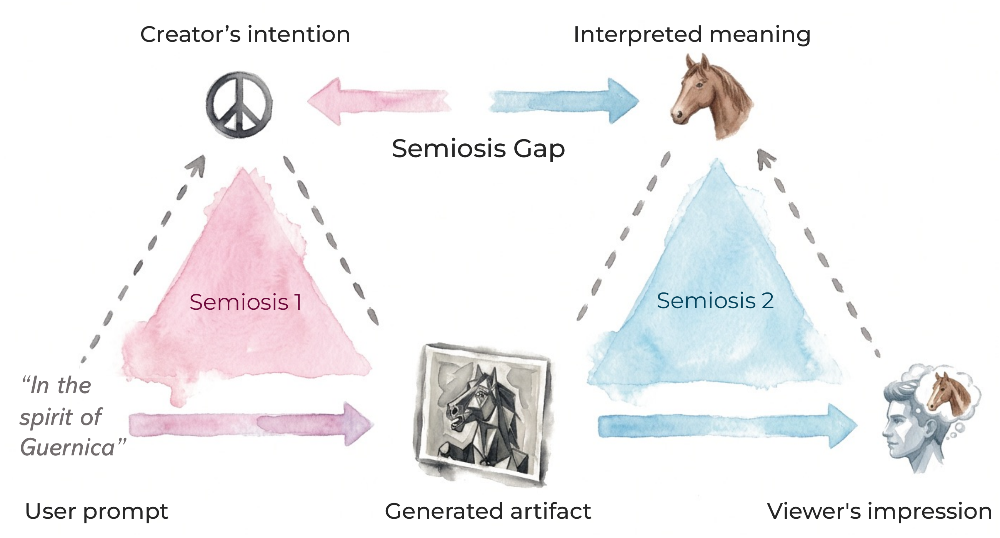
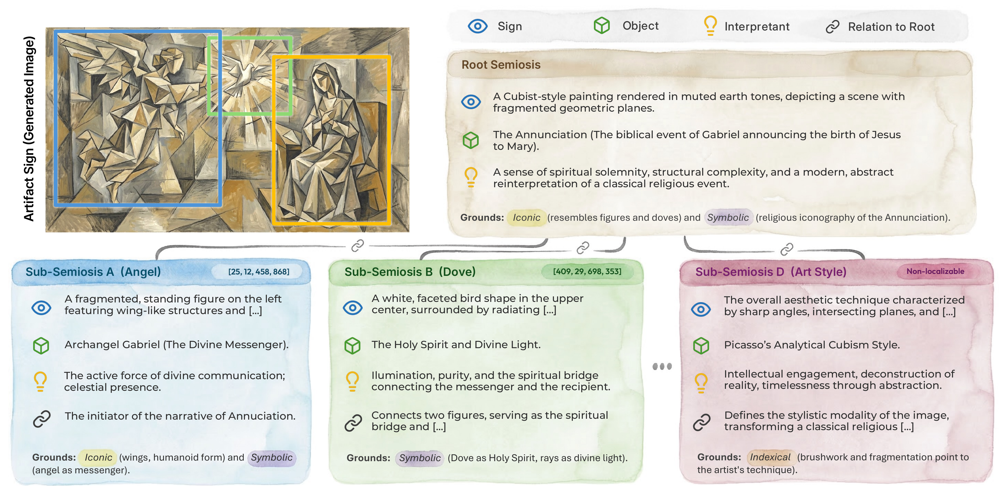

# On Semiotic-Grounded Interpretive Evaluation of Generative Art

Existing Generative Art evaluation mostly focuses on surface-level realism, aesthetics, or prompt matching. This project studies how to evaluate the deeper symbolic and interpretive meaning conveyed by generated art.

## SemJudge: Interpreting Human-GenArt Interaction with a structured semiotic analysis

